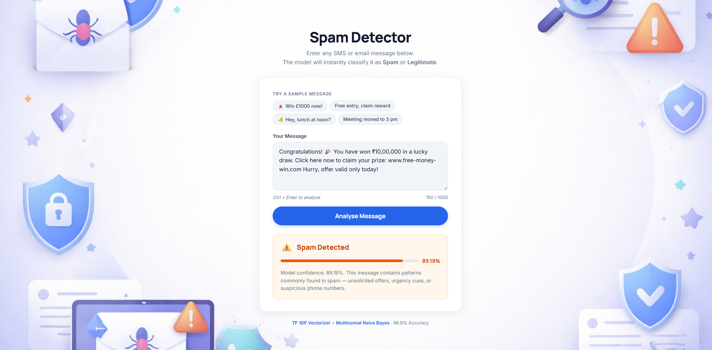

# Spam Detector AI



A production-ready **Spam Detection Web App** built with Python (Flask) and Scikit-learn. Enter any SMS or email message and the model will instantly classify it as **Spam** or **Legitimate (Ham)**.

---

## Algorithm & Process

This project uses a **100% authentic Machine Learning pipeline** trained on real-world data. It implements a **Multinomial Naive Bayes** classifier, one of the most effective algorithms for text-based classification.

### The Pipeline: `Text → Preprocessing → TF-IDF Vectorizer → Multinomial Naive Bayes`

1.  **Text Preprocessing**: 
    Every message is cleaned to remove noise.
    *   **Normalisation**: All text is converted to lowercase.
    *   **Noise Removal**: Punctuation and special characters are stripped.
    *   **Stopword Removal**: Common English words (e.g., "is", "the", "and") are removed using the **NLTK** library.

2.  **TF-IDF Vectorization**: 
    Converts raw text into a numerical format.
    *   **Term Frequency (TF)**: Counts word repetitions in a message.
    *   **Inverse Document Frequency (IDF)**: Highlights distinctive words like "Free" or "Winner" by down-weighting globally common words.

3.  **Multinomial Naive Bayes (MNB)**: 
    *   Uses **Bayes' Theorem** to calculate the probability of "Spam" vs "Ham" based on word weights.
    *   Fast, efficient, and highly accurate for sparse text data.

> [!NOTE]
> The model is serialised in `model.pkl`, storing the mathematical state of both the vectorizer and the classifier for instant predictions.

---

**Model Performance (test split 80/20):**
| Metric | Ham | Spam |
|---|---|---|
| Precision | 96% | 100% |
| Recall | 100% | 77% |
| **Accuracy** | **96.86%** | — |

---

## Folder Structure

```
Akash-email-ml/
│
├── app.py               # Flask web server — loads model, serves UI, handles /predict
├── model.pkl            # Serialised Scikit-learn pipeline (TF-IDF + Naive Bayes)
├── requirements.txt     # Python dependencies
│
├── ml_training/
│   ├── spam.csv         # SMS Spam Collection dataset (5,572 labelled messages)
│   ├── train.py         # Training script — preprocesses data, trains pipeline, saves model.pkl
│   └── __init__.py      # Package initialisation
│
├── static/
│   └── images/
│       └── bg.png       # Background image
│
└── templates/
    └── index.html       # Single-file frontend (HTML + CSS + JS, light theme SaaS UI)
```

---

## Quick Start

### 1. Install dependencies
```bash
pip install -r requirements.txt
```

### 2. Train the model
```bash
cd ml_training
python train.py
# Generates ../model.pkl
```

### 3. Run the app
```bash
python app.py
```

### 4. Open in browser
```
http://127.0.0.1:5000
```

---

## Tech Stack

| Layer | Technology |
|---|---|
| Backend | Python 3, Flask |
| ML Model | Scikit-learn Pipeline (TF-IDF + MultinomialNB) |
| Serialisation | Joblib |
| NLP Preprocessing | NLTK (stopwords) |
| Frontend | Vanilla HTML · CSS · JavaScript (fetch API) |
| Dataset | UCI SMS Spam Collection (5,572 records) |

---

## Dataset

- **Source:** UCI Machine Learning Repository — *SMS Spam Collection*
- **Size:** 5,572 messages
- **Labels:** `ham` (4,825 legitimate) · `spam` (747 spam)
- **File:** `ml_training/spam.csv`

---

## Sample Test Messages

```
# Spam examples
"WINNER!! You have been selected to receive a £1000 prize! Call 09061701461."
"Free entry in a weekly competition to win FA Cup tickets. Text FA to 87121."

# Ham examples
"Hey, are we still meeting for lunch at noon today?"
"Hi team, the 2 pm meeting has been moved to 3 pm. Same room."
```
